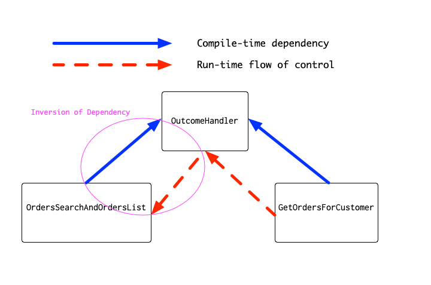

# DIP React

A sample project illustrating one way to apply the Dependency Inversion Principle to a simple React app.

## Project Setup

This project was bootstrapped with [Create React App](https://github.com/facebook/create-react-app).
Clone the project and install its dependencies:

```bash
$ git clone https://github.com/alexbasson/dip-react.git
$ cd dip-react
$ npm install
```

## Available Scripts

In the project directory, you can run:

### `npm start`

Runs the app in the development mode.<br>
Open [http://localhost:3000](http://localhost:3000) to view it in the browser.

The page will reload if you make edits.<br>
You will also see any lint errors in the console.

### `npm test`

Launches the test runner in the interactive watch mode.<br>
See the section about [running tests](https://facebook.github.io/create-react-app/docs/running-tests) for more information.

## How do I use this demo?

### See what the app does

Begin by checking out the `master` branch. Start the app with `npm start` and check it out in the browser.

Pretty sweet, right? It lists three customers and offers you a form in which you can search for a customer by first name and see their orders.

Try searching for some customer orders. You might try searching, for example, for:
- 'harry'
- 'ron'
- 'hermione'
- 'draco'

You'll see a loading message while the orders are fetched. Notice how searching for 'ron' yields a message informing you there are no orders for that customer. Notice, too, how searching for 'draco' informs you that there is no customer by that name.

### Examine the code

Open up the code in your favorite editor or IDE. Poke around as you like, but in particular, take a look at the `OrdersSearchAndOrdersList.js` file.

### Try refactoring it

There's a lot going on here, and it's ripe for refactoring. As a challenge, see if you can refactor it in stages, ending up by using the Dependency Inversion Principle to remove all (that's right, *all*) of the conditional code from the component. Make sure that *before* you start refactoring, you begin by writing some good tests for the component, and that as you refactor, you run the tests to make sure they're green!

### View an example refactoring

If you'd like to see one way to do it, check out the `refactor` branch. If you run `git log`, you'll see a number of commits on this branch—each commit represents one refactoring step.

The first commit on the branch adds some tests for the the `OrdersSearchAndOrdersList.js` file, and the remaining commits each perform one refactoring step, with the tests running green at the end of each one.

## Where's the DIP?

I wrote this demo in JavaScript, not TypeScript, even though I prefer to use TypeScript whenever I can. The reason I chose JavaScript for this demo is to illustrate that the DIP doesn't require that the language you're using has such syntactic sugar as explicit `interface` structures. As I'll explain, in JavaScript the compile-time dependencies are often implicit, but they're still there.



### Compile-time Dependencies

By the end of the refactoring, I had created a new class: `GetOrdersForCustomer`. The `OrdersSearchAndOrdersList` has a compile-time dependency on `GetOrdersForCustomer`. Notice how this is true even though `OrdersSearchAndOrdersList.js` does not explicitly import `GetOrdersForCustomer`.

Had this project used TypeScript, I would have had to declare an `interface` for the component's `props`, and that interface would have had to have made an explicit reference to `GetOrdersForCustormer`. In other words, here the compile-time dependency of `OrdersSearchAndOrdersList` on `GetOrdersForCustomer` is implicit, but no less real.

### Run-time Flow of Control

The run-time flow of control, however, goes in the other direction. All of the logic for determining which response outcome occurs is placed inside `GetOrdersForCustomer`'s `execute()` method, which takes two parameters: the search `query` and an `outcomeHandler`. The body of `execute()` contains the logic for determining the response outcome, and then the appropriate outcome method is called on the `outcomeHandler`.

In other words, at run-time the flow of control goes from `GetOrdersForCustomer` to its `outcomeHandler`, which is implemented by `OrdersSearchAndOrdersList`.

Again, had I used TypeScript, I would have had to have made an explicit interface, e.g.:

```typescript
interface OutcomeHandler {
  loading(): void;
  receivedOrders(orders: Order[]): void;
  noOrdersFound(query: string): void;
  noCustomerFound(query: string): void;
}
```

In order to declare that it implements `OutcomeHandler`, `OrdersSearchAndOrdersList` would have needed to explicitly depend on the interface at compile-time. And so again, in JavaScript the dependency is implicit—but no less real.

### How is this better?

This design offers a number of advantages:
- By moving the response outcome logic into a plain old JavaScript object, it becomes much easier to test. As an exercise, write some tests for `GetOrdersForCustomer`. Notice how much easier it is than the tests for `OrdersSearchAndOrdersList`, given that you don't have to deal with React's lifecycle, nor do you have to wrestle with Enzyme or your DOM-querying method of choice.
- The `OrdersSearchAndOrdersList` component is dead simple. It has no conditional logic whatsoever, and it's much easier to read and maintain.
- By introducing an abstraction—in this case, `OutcomeHandler` (however implicit)—the response outcome logic is decoupled from any awareness of who is calling it. Indeed, if necessary the app could be re-implemented in Angular or Vue instead of React, and `GetOrdersForCustomer` would be completely unchanged; it has no knowledge or dependency on any framework code at all.
- Decoupling the response outcome logic from the component also makes it possible to re-use it. Suppose, for example, that multiple components were interested in the outcome of getting orders for a customer. It would be quite simple to refactor `GetOrdersForCustomer` to have an internal array of `outcomeHandler`'s, and each interested component could register itself as an `outcomeHandler`. When an outcome occurs, `GetOrdersForCustomer` would iterate over its array and call the appropriate outcome method on each `outcomeHandler`, which would then respond as appropriate.
- This design uses the '[Observer](https://en.wikipedia.org/wiki/Observer_pattern)' pattern. In principle, it's not substantially different from using callbacks, `Promise`, or [rxjs](https://github.com/Reactive-Extensions/RxJS) -style `Observable`. Using the Observer pattern, however, allows us to translate the response outcomes from the generic language of `Promise`, `then`, and `catch` into the domain-specific language of `receivedOrders`, `noOrdersFound`, and `noCustomerFound`.
